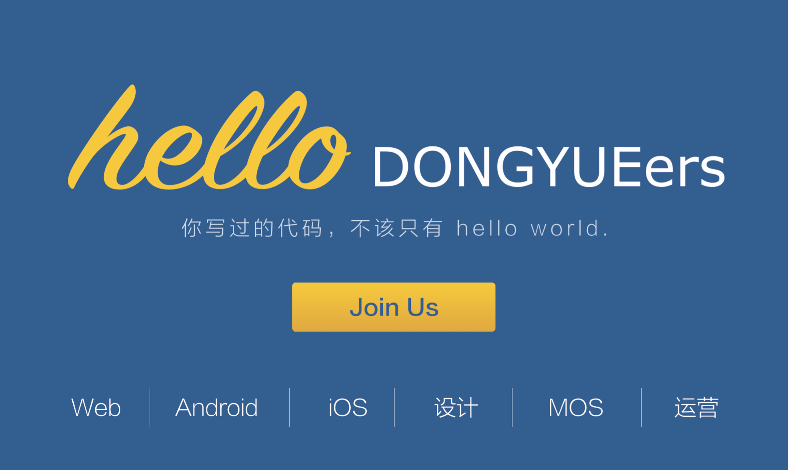

# 东岳招新

## 东岳是谁?

我们是东岳网络工作室 (Dongyue Studio), 交大校内一个默默无闻的学生组织, 随缘结友, 技术相长. 我们期望有不定期分享, 有一对一指导, 辅以校内外实战项目, 在技术、设计、产品、运营等各方面让自己有所成长, 让组织有所积累, 让世界有所改变.

## 团队介绍

### Web 组

> 时刻关注前后端最新技术.

招新要求:

- 大一
  - 对 Web 开发和前沿技术感兴趣, 没写过代码也没关系;
  - 愿意投入时间和精力.
- 大二
  - 能够使用至少一种编程语言, 会 JavaScript / Python / PHP 更佳;
  - 做过课内或课外的小型项目, 或有过网站开发相关的尝试 (请附项目说明).
- 大三及以上
  - 欢迎简历砸来~!

### Android 组

> 少年, 我见你脑后冒着绿光跟我学写 Android 吧 (

招新要求:

- 对 Android 开发感兴趣;
- 关注新框架新技术;
- 有时间有精力.

### iOS 组

> Write the code. Change the world.

招新要求:

- 基础要求
  - (必需) 拥有 MacBook;
  - 写过 C / C++ / JavaScript.
- 加分项
  - 知道 Web 开发是怎么回事;
  - 玩过 Objective-C / Swift.
  - 写过 iOS App.

### 设计组

> 我们希望用设计去更好地解决问题, 从而让世界更美好一点点.

招新要求:

- 基础要求
  - 对设计感兴趣, 愿意花时间去学 PS, Axure 或其它设计工具, 并不断完善自己的设计结果.
- 加分项
  - 设计过海报、网页、app 等. (请附上相关作品和设计说明.)

### MOOC & Open Source 组

> 让每个人可以自由的获得源码 /
按照自己的意愿修改代码 /
从而使得所有使用的人都受益 /
这就是开源之美吧

招新要求:

- 基础要求
  - 至少了解一门编程语言 (如 Java, C++ 等);
  - 想为开源做贡献.
- 加分项
  - 自己维护有开源项目, 或者是开源项目的 contributor;
  - 熟悉一个或多个开源项目.

注: 因为 OCC 组是今年才设立的, 所以各方面都不是很成熟, 如果有大腿还望不吝赐教!

### 产品组

他们说: 你啥都不会只能做产品咯. :neutral_face: 
小凡姐说: 瞎讲, 做了产品我啥都会了. :smirk:

招新要求:

- 产品经理已经快累死了, 我们真的需要一支产品团队. 今年, 我们要做点大事, 希望有你在.

## 加入我们

\>\> [Join us](http://tongqu.me/act/9936) <<

Mail：`'oi.euygnod@nioj'[::-1]`
